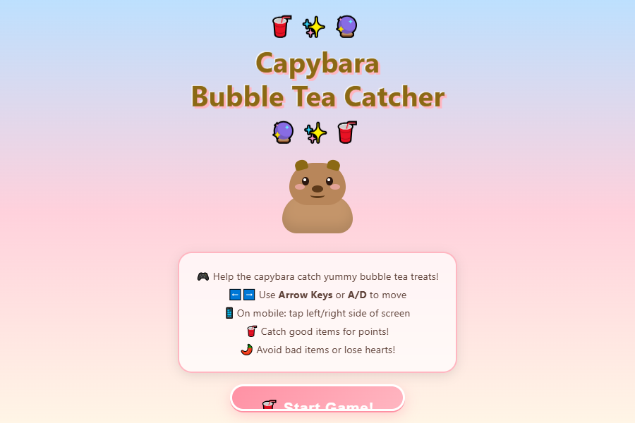
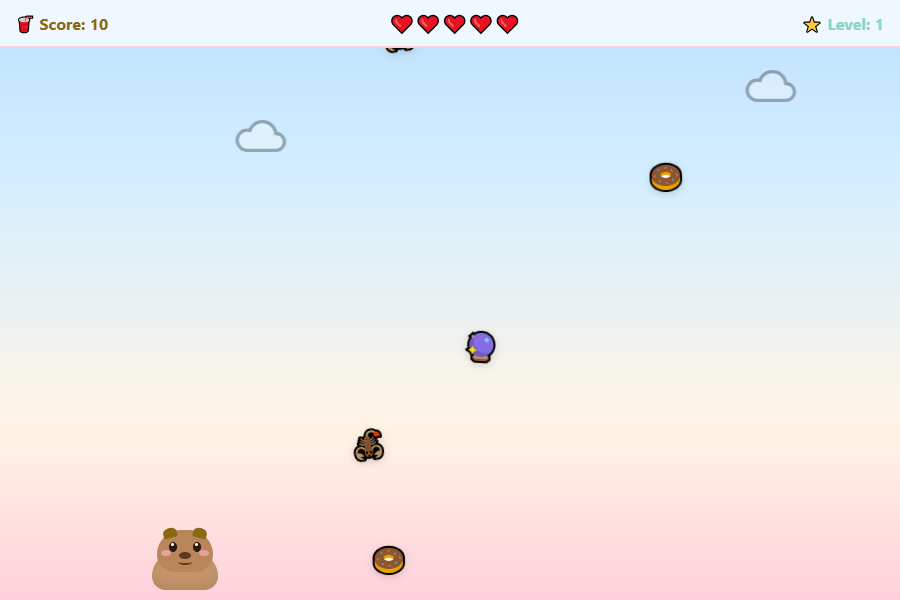
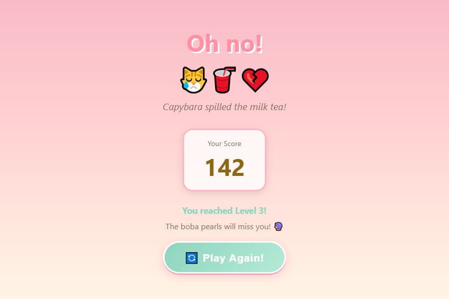

<div align="center">

# 🥤 水豚奶茶接接乐

这是 `capybara-child-game-builder` 仓库中的可运行基础游戏目录。若从该仓库根目录拉取，
请先进入 `game/` 再执行 `npm start`。

### _帮助最可爱的水豚接住美味的奶茶点心！_

[](#-在本地运行)
[](#)
[](#)
[](#)
[](#)

</div>

---

## 🎮 本地试玩

启动项目自带服务器后，访问 `http://127.0.0.1:8001/index.html`。正式线上地址需要在具备后端和持久化存储的托管环境中部署。

---

## 📸 游戏截图

<div align="center">

### 开始画面



### 游戏画面



### 游戏结束画面



</div>

---

## 🌸 游戏介绍

《水豚奶茶接接乐》是一款可爱风格的休闲网页游戏。玩家需要控制一只可爱的水豚，接住从上方掉落的奶茶和各种点心，同时躲开危险物品。

整个游戏使用原生 HTML、CSS 和 JavaScript 编写，不依赖框架、第三方库或外部素材。打开网页就可以直接游玩。

### ✨ 游戏特色

- 🎨 粉色、薄荷绿、奶油色和天空蓝组成的柔和配色
- 🐻 使用 CSS 绘制的水豚角色
- 🎵 使用网页音频接口制作的音效
- 📱 支持电脑和手机
- ⚡ 使用 `requestAnimationFrame` 实现流畅的 60 帧游戏循环

---

## 🕹️ 游戏玩法

| 操作 | 电脑 | 手机 |
| ---------- | ---------------- | ------------------------------------ |
| 向左移动 | `←` 方向键或 `A` | 点击屏幕左侧或左箭头按钮 |
| 向右移动 | `→` 方向键或 `D` | 点击屏幕右侧或右箭头按钮 |

### 可以接住的物品 ✅

| 物品 | 分数 |
| ------------- | ------ |
| 🥤 奶茶 | +30 |
| 🔮 珍珠 | +20 |
| ❤️ 爱心 | +16 |
| 🍓 草莓 | +24 |
| 🍰 蛋糕 | +20 |
| 🍮 布丁 | +20 |
| 🍡 团子 | +24 |
| 🌸 樱花 | +10 |
| 🍪 曲奇 | +16 |
| 🍩 甜甜圈 | +20 |

### 需要躲开的物品 ❌

| 物品 | 扣除爱心 |
| -------------- | ------ |
| 🌶️ 辣椒 | -1 ❤️ |
| 💣 炸弹 | -1 ❤️ |
| ⛈️ 乌云 | -1 ❤️ |
| 🍋 酸柠檬 | -1 ❤️ |
| 💀 骷髅 | -2 ❤️ |
| 🦂 蝎子 | -1 ❤️ |
| 👻 幽灵 | -1 ❤️ |

---

## ⚙️ 游戏功能

- ✅ 分数系统：接住好物品可以获得分数
- ✅ 生命值系统：共有 5 颗爱心，全部失去后游戏结束
- ✅ 关卡系统：每获得 50 分，难度就会提高
- ✅ 开始画面：包含标题、水豚预览和玩法说明
- ✅ 游戏结束画面：显示最终分数、到达关卡和鼓励语
- ✅ 视觉效果：粒子、飘浮分数、屏幕闪烁和水豚动作
- ✅ 音效：接住、受伤、升级和游戏结束音效
- ✅ 手机支持：触摸操作和屏幕按钮
- ✅ 响应式布局：自动适应不同大小的屏幕
- ✅ CSS 水豚：会眨眼、有腮红和耳朵动画
- ✅ 完整重开：重新开始时会清除上一局的状态
- ✅ 四个固定账号：昵称选择、简单密码登录
- ✅ 最高分排行榜：服务器保存每位玩家的最高分

---

## 🛠️ 使用的技术

| 技术 | 用途 |
| --------------------- | -------------------------------------------------------- |
| **HTML5** | 游戏结构、画面和状态栏 |
| **CSS3** | 样式、动画、角色和响应式布局 |
| **JavaScript（ES6+）** | 游戏逻辑、输入、碰撞检测和音效 |
| **Web Audio API** | 制作轻量级音效 |
| **Node.js** | 提供登录、分数保存和排行榜接口 |

游戏前端不需要框架；服务器只使用 Node.js 内置模块，不需要安装第三方依赖。

---

## 🚀 在本地运行

```bash
# 下载本仓库
git clone https://github.com/wangdaliuliuliu/capybara-child-game-builder.git

# 进入游戏目录
cd capybara-child-game-builder/game
# 只有基础接物玩法时，也可以直接打开 index.html
start index.html        # Windows 系统
open index.html         # macOS 系统
xdg-open index.html     # Linux 系统
```

如果要使用登录、最高分和排行榜，请启动项目自带的小服务器：

```bash
npm start
```

然后访问 `http://127.0.0.1:8001/index.html`。

也可以使用基础静态网页服务器（这种方式不能提供登录和共享排行榜）：

```bash
# 使用 Python
python -m http.server 8000

# 使用 Node.js（npx）
npx serve .
```

然后在浏览器访问 `http://localhost:8000`。

---

## 📁 项目结构

```
capybara-bubble-tea-catcher/
├── index.html                    # 游戏页面结构
├── style.css                     # 样式、动画和响应式布局
├── script.js                     # 游戏逻辑、输入、碰撞和音效
├── server.js                     # 登录、分数保存和排行榜接口
├── package.json                  # Node.js 启动配置
├── Dockerfile                    # 上线部署准备文件
├── README.md                     # 项目说明
├── docs/                         # 游戏规则和上线配置说明
├── data/                         # 运行时账号和最高分数据
└── assets/
    └── screenshots/
        ├── start.png             # 开始画面截图
        ├── gameplay.png          # 游戏画面截图
        └── gameover.png          # 游戏结束画面截图
```

---

## 🏗️ 代码结构

JavaScript 代码分为以下几个部分：

| 模块 | 作用 |
| --- | --- |
| **常量和配置** | 游戏设置、物品定义和提示语 |
| **游戏状态** | 分数、生命值、关卡和物品等状态 |
| **音效系统** | 管理游戏音效 |
| **画面管理** | 显示和隐藏开始、游戏和结束画面 |
| **输入处理** | 电脑键盘、触摸和手机按钮 |
| **物品生成** | 随机生成好物品和坏物品 |
| **碰撞检测** | 判断水豚是否接住物品 |
| **视觉效果** | 粒子、飘浮文字和屏幕闪烁 |
| **难度调整** | 逐渐提高掉落速度和生成频率 |
| **游戏循环** | 持续更新游戏画面和状态 |

---

## 🔮 后续可以增加的内容

- 🔊 **音效开关**：静音或恢复音效
- 🏆 **排行榜扩展**：后续可以加入到达关卡、连续接住次数等更多统计
- 🎯 **连续接住奖励**：连续接住物品时增加奖励倍数
- 🛡️ **特殊道具**：护盾、磁铁和时间减速
- 🎨 **水豚服装**：解锁不同的水豚外观
- 🌍 **更多关卡**：海滩、太空和樱花公园等主题背景
- ⏸️ **暂停按钮**：游戏中暂停或继续
- 🎵 **背景音乐**：循环播放可爱的旋律
- 📊 **游戏统计**：记录游戏次数和接住的物品总数
- 🤝 **分享分数**：分享游戏成绩

---

## 👤 制作信息

本项目由 AI 根据用户需求制作并不断完善。

- **设计**：以奶茶文化为灵感的可爱柔和风格
- **角色**：使用 CSS 绘制的水豚
- **音效**：使用程序实时生成

---

<div align="center">

由 AI 用 💖 和 🥤 制作

_如果你喜欢这个游戏，欢迎给它点个 ⭐！_

</div>
